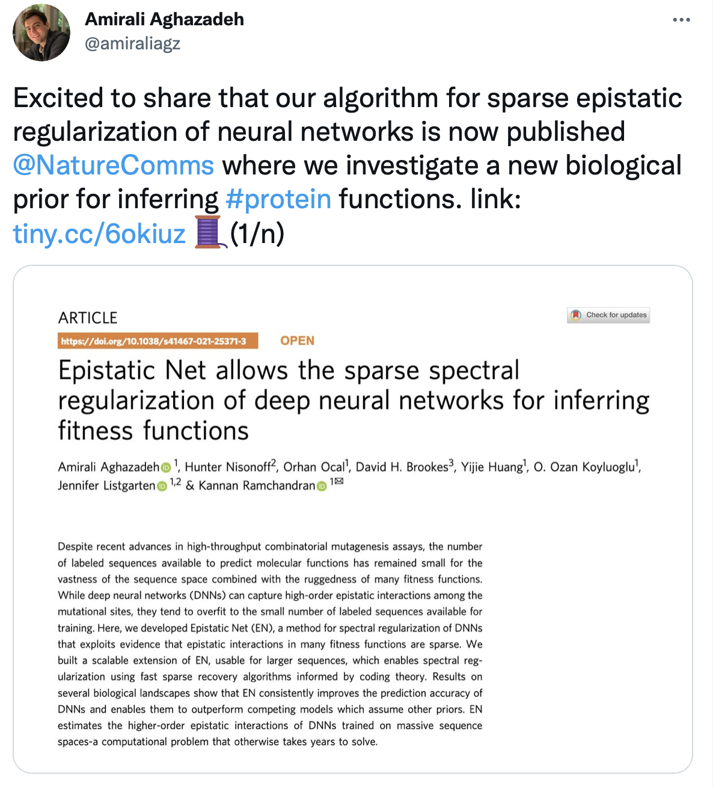

 I wrote a thread on the motivation and appraoch we took in explaining neural networks trained for protein inference tasks in terms of higher order epistatic interactions and regularize them to induce sparisty. Follow the thread below to read more on <a href="https://twitter.com/amiraliagz/status/1433166561892765697">Epistatic Net</a>:

    
        <figcaption class="caption"></figcaption>

